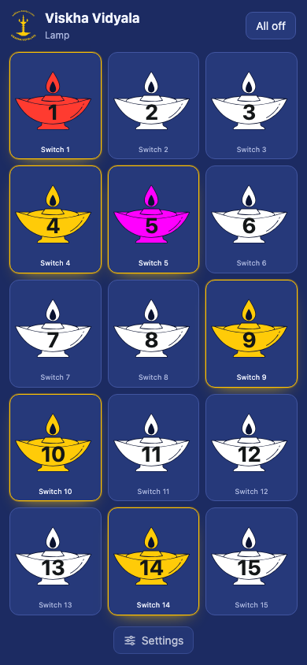

# Visakha-Lamp

A 22-lamp light panel driven by an ESP32 and controlled from any phone. The ESP32
runs its own Wi-Fi access point and serves the control page itself, so there is no
app, no router and no internet connection involved.



## Hardware

| | |
|---|---|
| Board | ESP32 Dev Module (developed on an ESP32-D0WD-V3, 4 MB flash) |
| LEDs | WS2812 / NeoPixel strip, 66 pixels — three per lamp |
| Data | GPIO 13 → strip DIN, through a 330 Ω resistor |
| Power | separate 5 V supply for the strip, ground shared with the ESP32 |

This branch drives the strip from the **SPI** peripheral instead of RMT: the data line
must sit on **GPIO 13**, the SPI2 (HSPI) native IOMUX MOSI pin, which the driver routes
through the IOMUX rather than the GPIO matrix. (SPI3's IOMUX MOSI is GPIO 23.) The
`main` branch uses RMT on GPIO 4 instead, so the wire has to move when you switch branches.

Change `NUM_GROUPS`, `LEDS_PER_GROUP` or `NUM_LEDS` at the top of `main/main.c` if
your panel is wired differently.

## Using it

1. Power the panel. It starts a Wi-Fi access point using the credentials from `.env`
   — by default SSID **Visakha Lamp**, password `12345678`.
2. Join it from a phone and open <http://192.168.4.1/>.
3. Tap a lamp to switch it. The `Settings` button at the bottom of the page holds the
   master brightness, the transitions, the animations, three colours, and each lamp's name.

Transitions and animations run on the real LEDs, not in the browser:

* **Transitions** — what a single lamp does when you switch it: `None` snaps, `Fade`
  glides (the default).
* **Animations** — what the whole panel does: `Random star` twinkles lamps at random,
  `Chase` sends a smooth glow up the panel, lighting one row at a time from the bottom.
* **Colours** — one triplet of colours for the whole panel, one per LED in a lamp, so
  every lamp always matches.
* **Light the rest** — fills in every lamp that is still dark, one per second, then waits
  out the hold (`Start animation after`, in seconds, default 15 minutes) and starts the
  chosen animation by itself. Pressing it again, tapping a lamp or `All off` stops it.

Brightness, transitions, animations, the hold, lamp names, the colours and the lamp states
are saved in flash and come back after a power cut.

The panel is labelled in the order you see it, and a lamp map in the firmware translates
those labels to the strip's wiring order, so the chase climbs the rows you actually have.

## HTTP API

| Request | Effect |
|---|---|
| `GET /` | the control page |
| `GET /set?i=<lamp>&v=0\|1` | switch lamp `i` (0–14) off or on |
| `GET /alloff` | switch every lamp off |
| `GET /brightness?v=<0-255>` | master brightness |
| `GET /transition?v=0\|1` | how a lamp switches: `0` none, `1` fade (default) |
| `GET /animation?v=0\|1\|2` | `0` none, `1` random star, `2` chase, bottom row to top |
| `GET /color?k=<0-2>&c=RRGGBB` | colour of one LED of every lamp: slot 0, 1 or 2 |
| `GET /name?i=<lamp>&n=<text>` | rename a switch (URL-encoded) |
| `GET /state` | JSON: `on`, `names`, `colors`, `brightness`, `transition`, `animation`, `hold`, `wait`, `sequence` |
| `GET /hold?v=<seconds>` | wait between the fill and the animation (default 900 = 15 min) |
| `GET /reset` | factory reset: clears every setting and lamp state |

### Lamp map

The panel is labelled 1–22 in the order you see it, but the strip was wired in a different
order, so `s_lamp_to_strip[]` in `main/main.c` records which strip position each label
sits at (lamp 1 → strip 10, lamp 2 → strip 11, lamp 3 → strip 9, …). Buttons, names,
colours and the running light all work in label order; only the pixel output is
translated, which is why the running light follows the labels rather than the wiring.

The firmware checks at boot that the table is a clean one-to-one mapping and logs an
error if it is not.

## Building

Requires [ESP-IDF](https://docs.espressif.com/projects/esp-idf/) v6.1 (installed here with `eim install`).

Set the access point credentials first. `.env` is git-ignored, so the password never
reaches the repository:

```sh
cp .env.example .env        # then edit AP_SSID and AP_PASS
```

Then build and flash:

```sh
source ~/.espressif/tools/activate_idf_v6.1.sh
idf.py set-target esp32
idf.py build
idf.py -p <PORT> flash monitor      # ls /dev/cu.* or /dev/ttyUSB* to find PORT
```

The top-level `CMakeLists.txt` reads `.env` while configuring, so changing it and running
`idf.py build` again is enough — no other file needs touching. If `.env` is missing the
build falls back to the defaults in that file.

## Layout

```
main/main.c            firmware: soft AP, HTTP server, WS2812 output, transitions
main/page.h            generated: the control page as a C string
web/page.html          the control page itself, hand-editable (SVGs inlined)
tools/build_page.py    web/page.html -> main/page.h
.env.example           template for the Wi-Fi credentials (copy to .env)
```

To change the page, edit `web/page.html`, run `python3 tools/build_page.py`, then flash.

Switch names, colours and brightness are held in RAM and reset when the panel is
unplugged; the switch states themselves start off.
